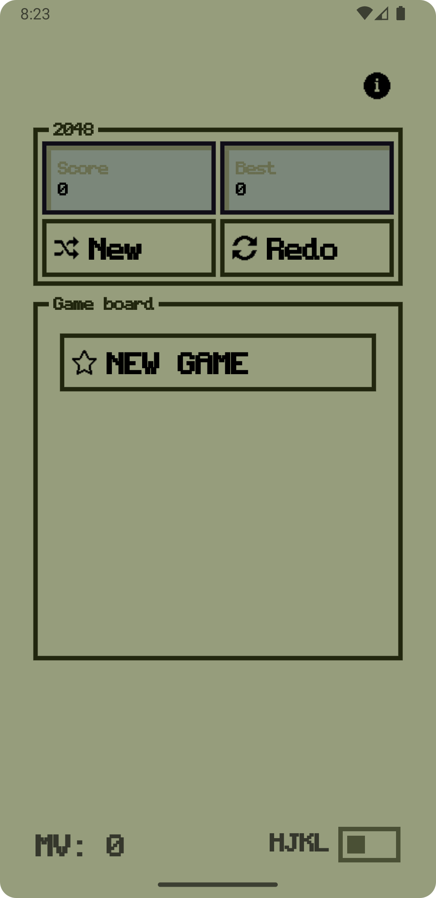
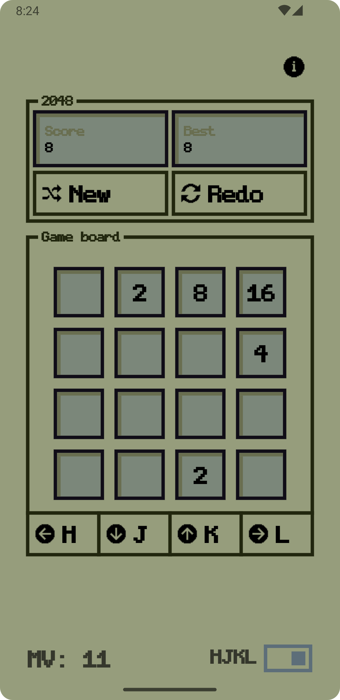

# YA2048CC

## Overview

__YA2048CC__ - Yet Another 2048 Compose Clone - Kotlin Multiplatform Compose implementation of the classic 2048 game, styled with a nostalgic retro LCD-inspired user interface for a unique gaming experience across platforms.",

## Features

- Built using Kotlin Multiplatform (KMP).
- Runs seamlessly on **iOS** and **Android**.
- **Nostalgic visual experience** inspired by classic LCD screens - see [YACRUK](https://github.com/andrew-malitchuk/yet-another-compose-retro-ui-kit).

|  |  |
|--------------------------------|---------------------------------|

## Troubleshooting

Encountering issues while using YA2048CC? Check out the troubleshooting section for common problems  
and solutions. If you still need assistance, feel free to reach out to the YA2048CC community  
for support.

## Contributing

I welcome contributions from the community to help improve YA2048CC. Whether you want to report a bug,  
suggest a new feature, or submit a pull request, follow the contribution guidelines outlined in the  
project's repository. Together, we can make YA2048CC even better.

## TODO

- [ ] fix commands for leaving comments;
- [ ] simplify jira commands;
- [ ] add commands params.

## License

MIT License

```  
Copyright (c) [2024] [Andrew Malitchuk]  
  
Permission is hereby granted, free of charge, to any person obtaining a copy  
of this software and associated documentation files (the "Software"), to deal  
in the Software without restriction, including without limitation the rights  
to use, copy, modify, merge, publish, distribute, sublicense, and/or sell  
copies of the Software, and to permit persons to whom the Software is  
furnished to do so, subject to the following conditions:  
  
The above copyright notice and this permission notice shall be included in all  
copies or substantial portions of the Software.  
  
THE SOFTWARE IS PROVIDED "AS IS", WITHOUT WARRANTY OF ANY KIND, EXPRESS OR  
IMPLIED, INCLUDING BUT NOT LIMITED TO THE WARRANTIES OF MERCHANTABILITY,  
FITNESS FOR A PARTICULAR PURPOSE AND NONINFRINGEMENT. IN NO EVENT SHALL THE  
AUTHORS OR COPYRIGHT HOLDERS BE LIABLE FOR ANY CLAIM, DAMAGES OR OTHER  
LIABILITY, WHETHER IN AN ACTION OF CONTRACT, TORT OR OTHERWISE, ARISING FROM,  
OUT OF OR IN CONNECTION WITH THE SOFTWARE OR THE USE OR OTHER DEALINGS IN THE  
SOFTWARE.  
```